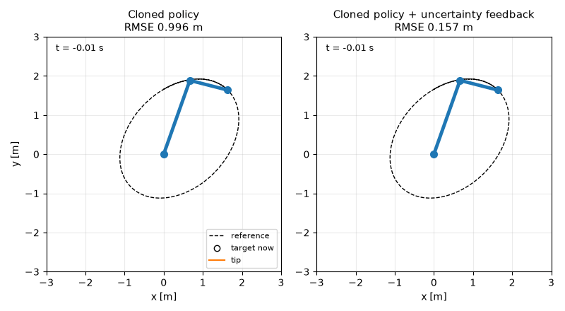
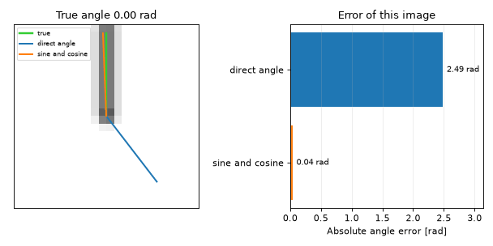
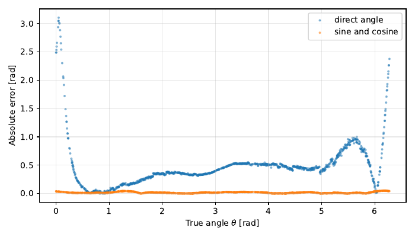
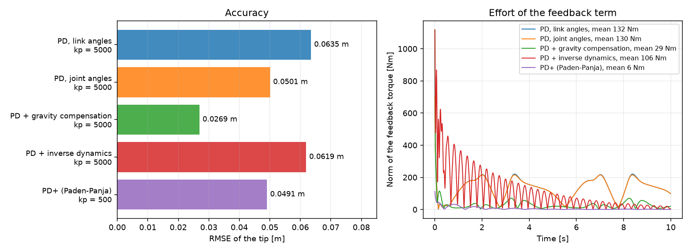
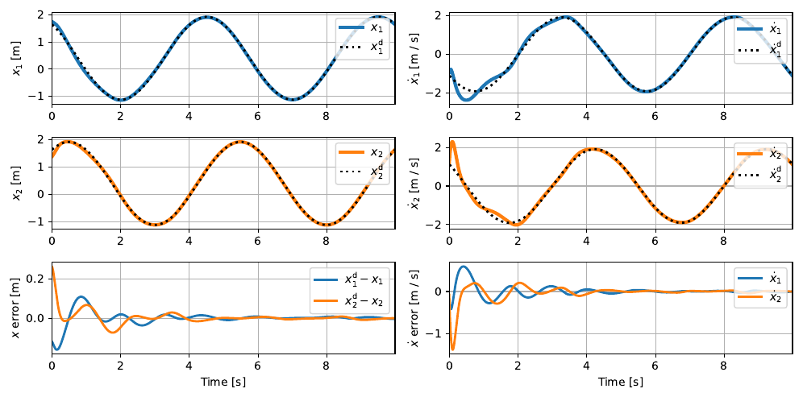
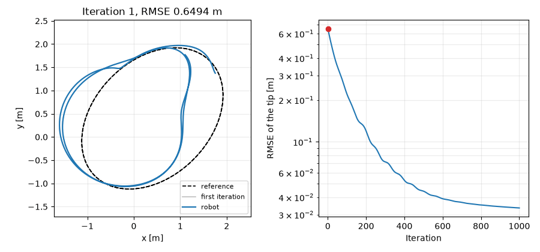
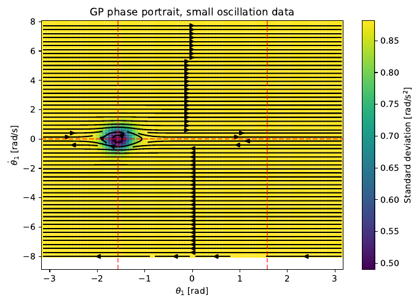
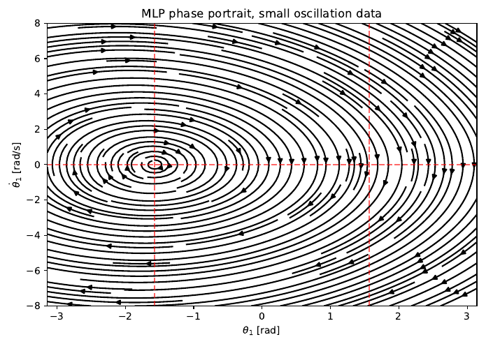

# Learning-based robot control

A 2-link robot arm learns to see itself, to model itself, and to know where its own model
is good.



One controller, two runs. A Gaussian process cloned a PD controller from a single run
along the ellipse. On the left the robot uses the mean of that process only, and it falls
off the path. On the right it also uses the variance: a torque along the negative gradient
of the variance pushes the robot back to the states that the model knows. Nothing else
changed. The path error falls from 0.996 m to 0.157 m.

---

## Three questions

1. Where is the robot? A convolutional network reads the joint angle from a camera
   image.
2. How does the robot move? A neural network learns the physics of the robot, and a
   learning controller corrects a model that is wrong.
3. How sure is the model? A Gaussian process reports its own uncertainty, and a
   controller uses that uncertainty as a feedback signal.

| Project | What it shows | Result |
|---|---|---|
| 1. Vision | The output representation of an angle changes the accuracy more than the network size. | 0.013 rad with sine and cosine, against 0.508 rad with the angle. The models differ by 31 parameters. |
| 2. Control | A feedforward term that knows the model does the work of a large feedback gain. | PD+ holds 0.049 m with a mean feedback torque of 6 N·m. Plain PD needs 132 N·m for 0.064 m. |
| 2. Learned model | A Lagrangian Neural Network learns the dynamics well enough to replace the physical model in the controller. | 0.049 m tip error with the learned model, against 0.049 m with the true model. |
| 2. ILC | Iterative Learning Control removes the effect of a model error of 80 %. | 0.034 m tip error, which is better than a PD controller with the correct model. |
| 3. GP | The variance of a Gaussian process makes an unstable cloned controller stable. | 0.157 m path RMSE, against 0.996 m without the variance term. |

---

## 1. Vision-based state estimation

`vision_state_estimation/` · PyTorch · [full page](docs/01-vision-state-estimation.md)

A CNN with 8000 parameters reads the angle of a pendulum from a 24x24 image. Two output
representations are compared:

* Direct — the network gives the angle. Error: 0.5075 ± 0.0857 rad.
* Indirect — the network gives the sine and the cosine, and `atan2` gives the angle.
  Error: 0.0126 ± 0.0033 rad.

The direct model must learn a function with a step where the angle wraps. Two angles that
are 0.02 rad apart get a penalty of 6.26 rad. The sine and the cosine have no step, so the
same network becomes 40 times more accurate.

The error must also wrap at the full circle. The labels go from 0 to 2π and `atan2` gives
a value in [−π, π], so a direct difference counts a full circle for a sample at the end of
the range.



*The link turns over the full circle. The green needle is the true angle, and the two
other needles are the angles that the models read from the 24x24 image at the left. The
bars give the error of that image.*



*The error of the direct model (blue) increases to 3 rad at the two ends of the range,
where the angle wraps. The sine-cosine model (orange) stays flat over the full circle.*

## 2. Model-based control, learned dynamics, iterative learning control

`robot_control/` · JAX, Flax, Optax · [full page](docs/02-model-based-and-learned-control.md)

The robot must follow an ellipse. It starts away from the path.

Classical control. PD in the link space and in the joint space, PD with gravity
compensation, PD with inverse-dynamics feedforward, and PD+ (Paden–Panja). PD+ reaches
0.0491 m with gains that are ten times smaller than the gains of the simple PD controller,
because its feedforward term makes the error dynamics linear.



*The five controllers reach a similar accuracy, and they do not use a similar effort. The
feedback term of PD+ uses 6.3 N·m on average, and the feedback term of the plain PD
controller uses 131.6 N·m. A small feedback gain means a soft robot, and a soft robot is
safer near a person.*

A Lagrangian Neural Network. Instead of the acceleration, the network learns the
energy. One network gives the mass matrix through a Cholesky form, so the matrix is always
positive definite. A second network gives the potential energy. Automatic differentiation
of the Lagrangian gives M, C and G, and an RK4 step gives the next state. The loss goes
through all of it.

After training on 249750 samples the learned model replaces the physical model in the
PD+ controller. The tip error is 0.0493 m, and the true model gives 0.0491 m.



*The controller uses the learned dynamics in its feedforward term. The tip follows the
reference, and the error goes to zero.*

Iterative Learning Control. The controller now uses a wrong model: its masses are
too large by a factor of 1.8. The closed loop is linearized along the path with
forward-mode automatic differentiation, discretized with a zero-order hold, and stacked
into a lifted system of 1998 × 1998. Q-ILC then computes the learning gains from an LQR
problem. After 1000 runs the tip error is 0.0335 m, although the model stays wrong.



*Each frame is one run of the robot. The grey line is the first run, where the wrong model
holds the tip away from the ellipse. The torque of the next run comes from the error of
the last run, and the model itself never becomes better.*

## 3. Gaussian processes and behavioural cloning

`gp_learning/` · GPyTorch · [full page](docs/03-gaussian-processes-and-cloning.md)

What a GP gives. An exact GP and a sparse GP fit a tensile test of steel. An ARD model
predicts the strength of concrete and finds by itself that the age of the sample has the
largest effect. The comparison of a constant mean against a zero mean is about safety: far
from the data, a zero mean warns and a constant mean does not.

Where a GP is better than an MLP. Both learn the dynamics of the robot. Where there is
no training data, the GP falls back to its prior and reports a large standard deviation.
The MLP gives a confident answer that disagrees with the physics.

|  |  |
|---|---|
| The GP outside its training data. Only the dark area near θ₁ = −π/2 holds data, and the bright area is a warning. | The MLP on the same data. It gives a full field with no bright area, so it gives no warning. |

Uncertainty as feedback. A GP with a periodic kernel clones a PD controller. It sees
the angles only, so the closed loop diverges. The variance of the GP is small on the
training path and large away from it. A torque along the negative gradient of the variance

    tau_repel = -k_var * sigma * sign(d(sigma^2) / d(theta))

moves the robot back to the path. The path RMSE falls from 0.996 m to 0.157 m, which the
animation at the top of this page shows. The controller gets a feedback to the path,
although it never knows the desired position.

A second experiment clones the path itself, without a teacher controller. There the same
idea helps (2.56 m to 2.03 m RMSE), but the controller stays weak. The
[full page](docs/03-gaussian-processes-and-cloning.md) explains why.

---

## Install and run

```bash
git clone git@github.com:gulerburak/learning-based-robot-control.git
cd learning-based-robot-control
pip install -e .
```

Python 3.10 to 3.13. A GPU is not necessary. The versions of JAX and Flax are pinned,
because the ILC tasks need 64-bit floats.

```bash
# Project 2 — seconds each
python -m robot_control.tasks.pd_control
python -m robot_control.tasks.pd_gravity_compensation
python -m robot_control.tasks.pd_plus
python -m robot_control.tasks.compare_controllers
python -m robot_control.tasks.linearize

# Project 3 — minutes
python -m gp_learning.tasks.gp_tensile
python -m gp_learning.tasks.make_robot_datasets
python -m gp_learning.tasks.dynamics_gp
python -m gp_learning.tasks.clone_torques

# Project 1 — make the images first
python -m vision_state_estimation.make_dataset --render
python -m vision_state_estimation.run

# Long jobs. Each has flags that make it shorter.
python -m robot_control.tasks.collect_dataset   # approximately 5 minutes
python -m robot_control.tasks.train_lnn         # approximately 1 hour on a CPU
python -m robot_control.tasks.pd_ilc            # approximately 3 minutes
python -m robot_control.tasks.q_ilc             # approximately 10 minutes
```

All scripts have an `argparse` interface. Use `--help`. The figures go into `outputs/`.
Four tasks can also animate their result:

```bash
python -m robot_control.tasks.compare_controllers --gif
python -m robot_control.tasks.q_ilc --gif
python -m gp_learning.tasks.clone_torques --gif
python -m vision_state_estimation.run --gif
```

```bash
pip install -e ".[dev]"
python -m pytest tests/test_lnn.py
```

The test checks the Lagrangian Neural Network against reference values.

---

## Repo map

| Path | Content |
|---|---|
| `vision_state_estimation/` | The dataset, the two CNNs, the training loop. |
| `robot_control/` | The controllers, the Lagrangian Neural Network, the linearization, PD-ILC and Q-ILC. `tasks/` holds the runnable scripts. |
| `gp_learning/` | The GP models, the MLP, the cloned controllers. `tasks/` holds the runnable scripts. |
| `jax_double_pendulum/` | The robot simulator. See the credit below. |
| `docs/` | One page for each project, and the measured results. |
| `data/` | The small datasets. See [data/README.md](data/README.md). |
| `tests/` | The reference test of the Lagrangian Neural Network. |

---

## Credit

The folder `jax_double_pendulum/` holds the robot simulator: the dynamics, the
kinematics, the trajectory generator and the plot helpers. It is third-party work under
the MIT licence, and it is used without change. The plot helpers `ilc.py`,
`ilc_analysis.py` and `lnn_analysis.py` in `robot_control/` have the same origin.
[LICENSE](LICENSE) names the copyright holders.

## Licence

MIT. See [LICENSE](LICENSE).
