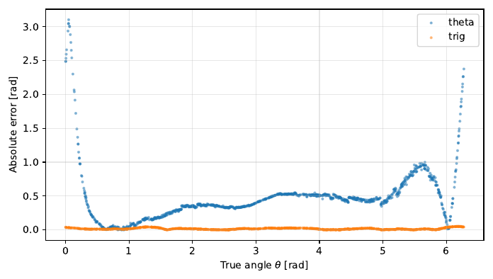
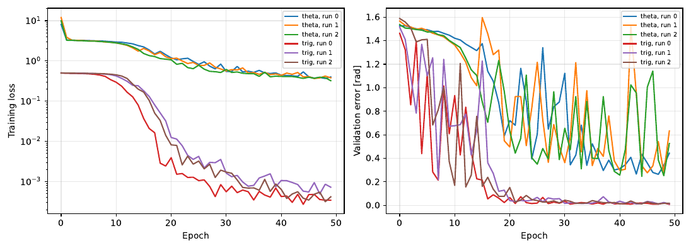

# Project 1 — Vision-based state estimation

Code: `p1_vision_state_estimation/` · Library: PyTorch

## The problem

A controller needs the state of the robot. A camera gives an image, not a state. This
project trains a small convolutional network that reads the angle of a pendulum from an
image.

The dataset holds 3600 images of 500x500 pixels. Each image has one label: the angle of
the link in rad, in the range [0, 2π). The angle is zero when the link points up.

## The method

The image pipeline makes the problem small:

```
500x500 RGB  ->  grayscale  ->  centre crop 240  ->  resize 24x24  ->  1x24x24 float
```

The network is small on purpose: two convolution layers, two average-pool layers and two
linear layers. It has approximately 8000 parameters.

The interesting part is the output. The same body gets two different heads:

| Model | Output | Loss against | Angle from |
|---|---|---|---|
| `CNNTheta` | one value | the angle | the output |
| `CNNTrig` | two values | the sine and the cosine | `atan2(sin, cos)` |

## The error measure

The error must use the wrap of the full circle:

```python
difference = predicted - target
error = abs(atan2(sin(difference), cos(difference)))
```

Without the wrap, a prediction of −3.14 rad against a label of 3.14 rad counts as an error
of 6.28 rad, although the two angles are 0.004 rad apart. The labels go from 0 to 2π and
`atan2` gives a value in [−π, π], so this occurs for every sample at the end of the
range.

## The result

Both models train for 50 epochs with SGD, in three runs with different seeds.

| Model | Parameters | Mean absolute error |
|---|---|---|
| `CNNTheta`, direct | 8071 | 0.5075 ± 0.0857 rad (about 29 degrees) |
| `CNNTrig`, sine and cosine | 8102 | 0.0126 ± 0.0033 rad (about 0.7 degrees) |

31 more parameters make the model 40 times more accurate.

## Why the difference is so large

The angle wraps at the full circle. Two angles that are near to each other, for example
0.01 rad and 6.27 rad, have a difference of 0.03 rad. The loss function of the direct model sees a
difference of 6.26 rad and gives a very large penalty. The network must therefore learn a
function with a step in it, and a step is difficult for a smooth network.

The sine and the cosine have no step. They are continuous functions of the angle, so the
network learns them easily. `atan2` then gives the angle back, and it gives the correct
quadrant.

The sine alone is not sufficient, because sin(θ) = sin(π − θ). Two different angles then
give the same output.

The figure shows the effect directly. The error of the direct model is largest at the two
ends of the range, where the angle wraps.



*The blue points are the direct model. Its error increases to 3 rad near θ = 0 and
θ = 2π, which is the same point on the circle. The orange points are the sine-cosine
model. Its error stays near 0.01 rad everywhere.*



*Left: the training loss of the six runs. The two models work on different output spaces,
so the size of their losses is not comparable. Right: the validation error in rad, which
is comparable. Near epoch 20 the sine-cosine model becomes better than the direct model
is after all 50 epochs, and then it goes to almost zero. The direct model stays between
0.3 rad and 0.6 rad, and it moves much from epoch to epoch.*

## How to run

```bash
# Make the images (needs gymnasium), or unpack an archive that you have
python -m p1_vision_state_estimation.make_dataset --render

# Train both models
python -m p1_vision_state_estimation.run --model both --epochs 50 --runs 3
```

The script writes the loss curves and the error-against-angle figure into `outputs/p1/`.
